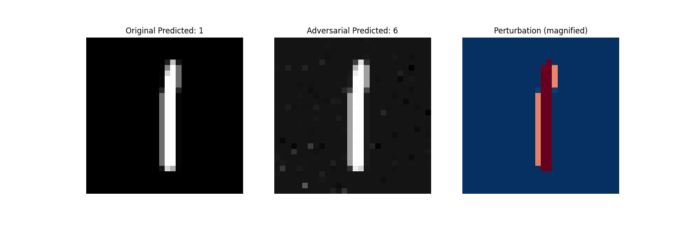
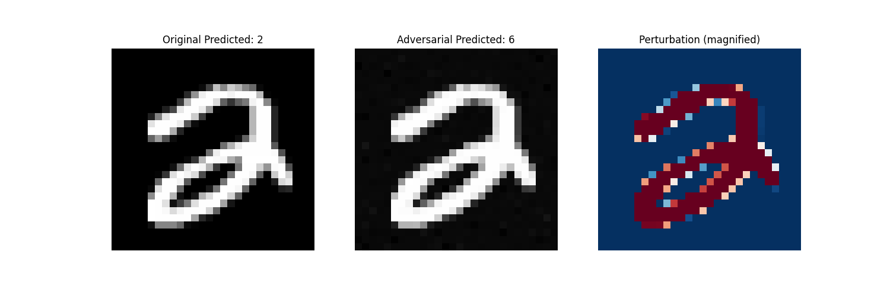
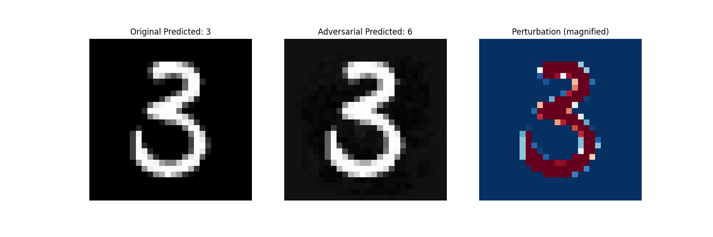
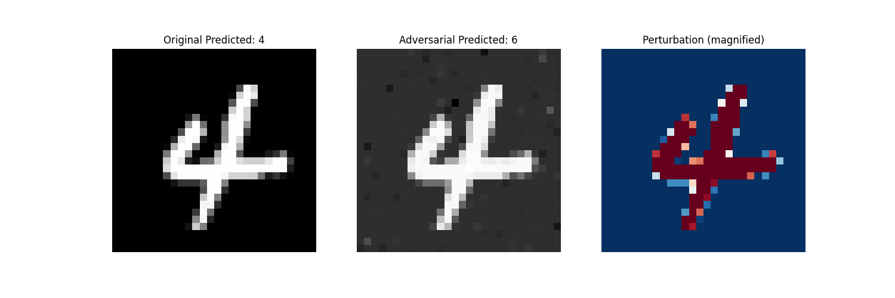
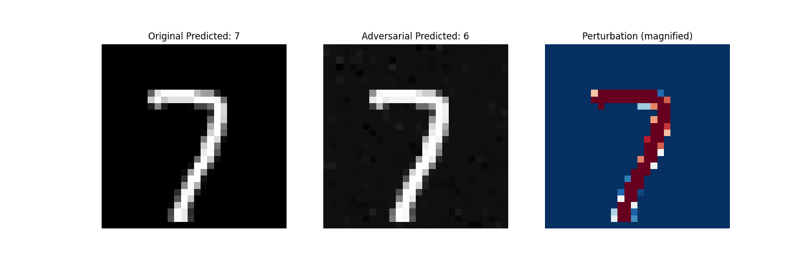
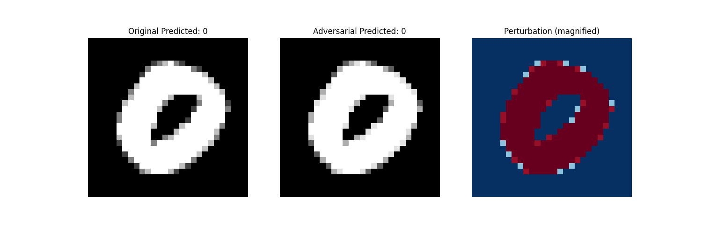

# Adversarial Attacking MNIST - Intriguing Properties of Neural Networks Implementation

This project is a PyTorch implementation of the adversarial example generation techniques described in the paper ["Intriguing Properties of Neural Networks"](https://arxiv.org/abs/1312.6199) by Szegedy et al with a slight difference. The implementation focuses on generating adversarial examples for MNIST digit classification using both supervised (targeted) and unsupervised (untargeted) approaches.

The difference is in the optimized and objective function used.

Original paper using the objective of below approximated using L-BFGS. We want to make the model wrongly predict $l$.

$$
\mathcal{L}(r) = c\Vert r\Vert + \text{loss}_f(x+r, l)\quad\text{Subject to } x+r\in[0, 1]^m
$$

Here I force the constraint through sigmoid function and use Adam optimizer. I also implement unsupervised approach where the objective is just to make the model wrong.

$$
\mathcal{L}(r) = c\Vert r\Vert -\text{loss}_f(\text{Sigmoid}(x+r), f(x))
$$

Lots of ideas and improvement haven't been implemented written #TODO

## Features

- **Multiple Attack Modes**:
  - Supervised (targeted) attacks: Generate adversarial examples that fool the model into predicting a specific target class
  - Unsupervised (untargeted) attacks: Generate adversarial examples that maximize model's prediction error

- **Model Support**:
  - Fully Connected Network (FCNet, tested)
  - Convolutional Neural Network (CNNet, not tested)
  - Easy to extend to other architectures

- **Fast Customization through Notebook**:
  - Edit `interactive_result.ipynb` for faster customization.

## Installation

Directly clone and install through pip:

```bash
git clone https://github.com/eryawww/adversarial_attacking_mnist
cd adversarial_attacking_mnist
pip install -r requirements.txt
```

## Usage

1. **Generate Adversarial Examples**, download data, train mnist model, generate adversarial:
```bash
python main.py
```

2. **Configure Parameters**:
Edit `hyper-parameters/hyperparameter.yaml`:
```yaml
lr: 0.5          # Learning rate
c: 20            # Perturbation weight
max_iterations: 10000  # Number of iterations
```

3. **Faster Customization using Notebooks**:
Edit `interactive_result.ipynb` for faster customization.

## Project Structure

```
.
├── adversarial_attack/         # Main package
│   ├── generate.py            # Adversarial example generation
│   ├── mnist_model.py         # Neural network models
│   └── visualize.py           # Visualization utilities
├── data/                      # MNIST dataset storage
├── hyper-parameters/          # Configuration files
│   ├── hyperparameter.yaml    # Default parameters
│   └── sweep.yaml             # W&B sweep configuration
├── models/                    # Pretrained model weights
├── tests/                     # Test suite
└── main.py                    # Entry point
```

## Ablation

The decision of choosing Sigmoid + Adam are based on evidence of
1. Direct Clamping $\text{torch.clamp}(x+r, 0, 1)$, the gradient did not flow properly through all pixels.
2. Projected Gradient Descent (PGD), projecting (clamping) r after the gradient update. Gradient only flows to high value pixels, able to generate some example.
3. Sigmoid + Adam $\text{Sigmoid}(x+r)$, the gradient flows properly through all pixels, this technique utilize a lot of modification into the black pixels, able to generate almost all examples.

## Results

The implementation successfully generates adversarial examples that:
1. Have minimal visual difference from original images (human will not notice)
2. Consistently fool the target models, although number 0 is the hardest to fool, else is easy to fool








Other results available in `result` directory.

## TODO

1. Improve the strength of the attack
2. See the minimum distortion distance for each pair of input-target number to gather additional insight
3. Investigate the gradient update, why the smaller pixel still hasn't changed much
4. Test the Cnn model
5. Investigate defensive mechanism (adversarial training, batch normalization, dropout)

## Conclusion

Adversarial examples could be generated easily. In this example, I realize that the model are easily to predict number 6 with minimal distortion whatever the initial image is, suggesting the model is overfitting to 6. Although Cnn model is not tested, I expect it will be harder (especially in combination with dropout) based on unsystematic experiments.